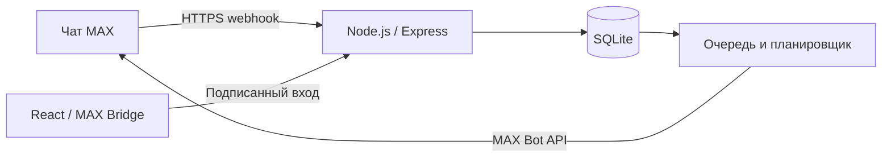

# Вовремя — календарь и чат-бот MAX

Вовремя помогает помнить о сроках документов и обращений за государственными, социальными и медицинскими услугами. Пользователь сохраняет дату, получает напоминание от бота, читает рекомендации и отмечает выполненное действие. Чат и мини-приложение работают с общим календарём.

[Открыть бота в MAX](https://max.ru/se14448730_bot) · [Репозиторий](https://github.com/nikeperl/MAX-hackaton) · [Презентация](docs/presentation.pdf)

## Запуск через Docker

Установите [Docker с Compose v2](https://docs.docker.com/compose/install/). В Windows и macOS используйте Docker Desktop; в Windows включите Linux containers. В Linux подходит Docker Engine с плагином Compose. Node.js на компьютере не нужен. Команды ниже одинаковы для PowerShell, Bash и zsh и выполняются из корня проекта.

```sh
docker compose -f compose.demo.yaml up -d --build --wait
```

Откройте **http://localhost:3002**. Интерфейс, API и SQLite работают в одном контейнере. Демо не требует `.env` или токена и не отправляет сообщения в MAX. Нужен интернет для первой загрузки образа и зависимостей; для первого распознавания изображений браузер загружает OCR-модели.

Демо использует отдельный стек `vovremya-demo` и том `demo-data`. Рабочий стек `max-hackaton` использует свой том `app-data`.

| Действие                         | Команда                                                   |
| -------------------------------- | --------------------------------------------------------- |
| Проверить состояние              | `docker compose -f compose.demo.yaml ps`                  |
| Посмотреть журнал                | `docker compose -f compose.demo.yaml logs --tail 100 app` |
| Перезапустить                    | `docker compose -f compose.demo.yaml restart`             |
| Остановить и убрать контейнеры   | `docker compose -f compose.demo.yaml down`                |
| Запустить снова или обновить код | Команда `up -d --build --wait` выше                       |

Именованный том сохраняется после остановки и пересборки. Опция `down -v` удаляет данные. Порт 3002 должен быть свободен; при конфликте измените левую часть `3002:3001` в `compose.demo.yaml`. Если Compose не знает `--wait`, обновите его до актуальной версии v2.

## Основной сценарий и проверка

Первый пилот ориентирован на жителей Новосибирской области, которые самостоятельно ведут сроки личных дел в разных сферах; сквозной пример проверки — замена паспорта в 20 лет. Подробное обоснование и метрики — в [описании продукта](docs/product.md).

1. В демо нажмите «Добавить событие» → «Личные документы» → «Замена паспорта РФ».
2. Укажите вымышленную дату рождения `20.10.2006` и возраст `20`. Ожидаемый срок — **18.01.2027**.
3. Сохраните событие и перезагрузите страницу: событие должно остаться в календаре.
4. Откройте карточку: доступны основание расчёта, рекомендации и источник. Нажмите «Выполнено»: событие переходит в завершённые.
5. Для импорта выберите [пример документа](public/example-document.txt), затем подтвердите дату `01.12.2026`. До подтверждения событие не создаётся.
6. Кнопка «Показать примеры» добавляет синтетические события. Каждый браузер получает отдельный демопрофиль; очистка его хранилища теряет доступ к этому профилю.

В MAX тот же путь начинается с любого сообщения боту: «Добавить событие» → сфера → услуга → дата → подтверждение. Через «Настройки» включите напоминания и выберите время. Уведомления приходят от бота при закрытом мини-приложении, если сервер работает. Полная [проверка чата, расписания и API](docs/verification.md) включает ожидаемые результаты.

## Возможности

- 46 шаблонов в 10 сферах и разделе «Личное»; поиск, группировка по сфере и сортировка по названию.
- Календарь, создание, изменение, завершение и удаление событий; произвольная дата через «Своё событие».
- Расчёт замены паспорта в 20/45 лет и обследования по интервалу врача. Остальные сроки вводятся из подтверждённого документа, решения или графика.
- Распознавание изображений, текстовых и сканированных PDF, импорт TXT. Ограничения: 15 МБ и до 5 страниц PDF; результат подтверждает пользователь.
- Кнопки бота для событий, рекомендаций, следующей даты и приватности уведомлений: переходы обновляют текущее сообщение, повторные нажатия не создают копии. Время задаётся сообщением `ЧЧ:ММ`; в мини-приложении часы и минуты выбираются отдельной прокруткой.

## Окружение и рабочий MAX

Для публичного сервиса необходимы постоянно работающий сервер, токен бота и доступный извне HTTPS на порту 443. Доступны два варианта развёртывания: [Docker с доменом и автоматическим TLS](docs/deployment.md) и [Windows с публичным IP](docs/windows-ip-hosting.md).

Конфигурация рабочего сервера задаётся в `.env`, созданном на основе [.env.example](.env.example).

| Переменная              | Назначение                                                                               |
| ----------------------- | ---------------------------------------------------------------------------------------- |
| `MAX_BOT_TOKEN`         | Токен, выданный платформой MAX                                                           |
| `MAX_BOT_USERNAME`      | Точный ник бота, без `@`, например `se14448730_bot`                                      |
| `MAX_WEBHOOK_SECRET`    | Случайный секрет webhook длиной 16–256 символов: латиница, цифры, `_`, `-`               |
| `APP_URL`               | Публичный адрес приложения, например `https://app.example.org`                           |
| `APP_DOMAIN`            | Домен без протокола для `compose.https.yaml`                                             |
| `MAX_API_URL`           | По умолчанию `https://platform-api2.max.ru`                                              |
| `PUBLIC_IP`             | Только для варианта `compose.ip.yaml`                                                    |
| `NODE_ENV`, `DEMO_MODE` | Рабочий Compose задаёт `production` и `false`; демо — `development` и `true`             |
| `PORT`, `DATABASE_PATH` | В контейнере: порт 3001 и SQLite в `/app/data`; локальные значения есть в `.env.example` |

| Режим                         | Доступные порты                               |
| ----------------------------- | --------------------------------------------- |
| Docker-демо                   | `127.0.0.1:3002`                              |
| Рабочий API                   | `127.0.0.1:3001`, публичный HTTPS через Caddy |
| Caddy с доменом               | TCP 80 и 443                                  |
| Caddy по IP                   | TCP 443                                       |
| Разработка / браузерные тесты | 5173 и 3001 / 5174 и 3003                     |

## Архитектура и данные



React отвечает за календарь и обработку документов в браузере. Express проверяет подпись MAX, хранит сессии и события в SQLite. Планировщик каждые 15 секунд обрабатывает входящие события и отправки. Подтверждённые сообщения повторно не отправляются после перезапуска. При сетевом тайм-ауте после принятия сообщения MAX повтор всё же возможен. Один экземпляр приложения обслуживает одну базу.

На сервер сохраняются MAX ID и имя, даты, параметры события, заметка, название файла, настройки и история доставки. Для расчёта паспорта сохраняется дата рождения. Оригиналы документов и полный распознанный текст остаются в браузере. Очередь webhook временно содержит входящие сообщения. Удаление событий не удаляет профиль и резервные копии; SQLite не зашифрована приложением.

Зависимости зафиксированы в `package-lock.json`: Node.js 22, React, Express, better-sqlite3, Zod, Tesseract.js и PDF.js. Внешние сервисы — MAX Bot API, MAX Bridge, CDN OCR-моделей и центр сертификации для публичного HTTPS. Для обращений к MAX в образ включён публичный корневой сертификат; приватных ключей в нём нет.

MVP не подключён к ЕСИА, ЕГИСЗ, статусам заявлений и хранилищу документов Госуслуг. Ссылки на ведомства открывают внешние сайты. Медицинский интервал задаётся по рекомендации врача; юридические исключения требуют уточнения у ведомства. Для пилота с реальными данными нужны законные основания обработки, защищённое размещение и резервное копирование. Доказанный эффект и проведённые интервью пока не заявляются.

## Документация

| Файл                                                    | Содержание                                                                           |
| ------------------------------------------------------- | ------------------------------------------------------------------------------------ |
| [Развёртывание](docs/deployment.md)                     | Docker, домен, TLS, webhook, обновление и сохранение данных                          |
| [Windows и публичный IP](docs/windows-ip-hosting.md)    | Альтернативная схема без домена и продление сертификата                              |
| [Разработка](docs/development.md)                       | Структура кода, необязательный запуск через npm, тесты, каталог, экспорт презентации |
| [Проверка](docs/verification.md)                        | Сценарии для браузера, MAX и API                                                     |
| [Соответствие требованиям](docs/requirements-review.md) | Проверка PDF «Забота о людях», подтверждения и оставшиеся условия сдачи              |
| [Продукт и пилот](docs/product.md)                      | Аудитория, текущий и предлагаемый путь, метрики и масштабирование                    |
| [Каталог](docs/service-catalog.md)                      | Отбор 153 исходных случаев и границы поддержки                                       |
| [Команда](docs/team.md)                                 | Участники и зоны ответственности                                                     |

Материалы сдачи: [публичная PDF-презентация](presentation.pdf), [её HTML-исходник](docs/presentation.html), [OpenAPI 3.0.3](openapi.json), [DATA-API.yaml](DATA-API.yaml), [синтетические API-данные](tests/fixtures/events.json). Публичная презентация содержит только продуктовые слайды. Закрытый PDF для жюри с первым служебным слайдом, рабочими параметрами и commit hash создаётся после коммита командой `node scripts/build-presentation.mjs`, затем `node scripts/export-presentation.mjs --private` и сохраняется в `submission/presentation-private.pdf`. Не публикуйте этот файл. В production проверяющий входит своим MAX-профилем; общего пароля нет. Публичный API: **https://84.237.53.134/api**. Для передачи кода используйте архив зафиксированного коммита и контрольную сумму SHA-256.
